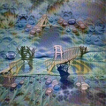
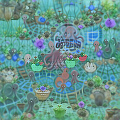

# pallete-from-generated-image

## About

First I generate images by [deep-daze](https://github.com/lucidrains/deep-daze).

Then, I think that images are strange, But colors are nice.

This Python script searches frequent colors from img folder.

And generate palette image to pallete folder.

## Example 

## Usage

- Check PIL and numpy installed
- Check img folder
- `python3 app.py`

